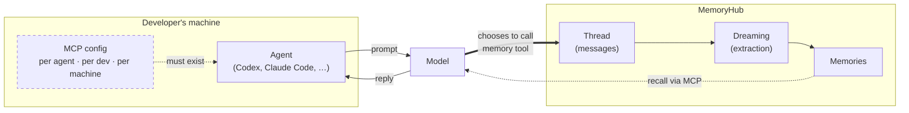
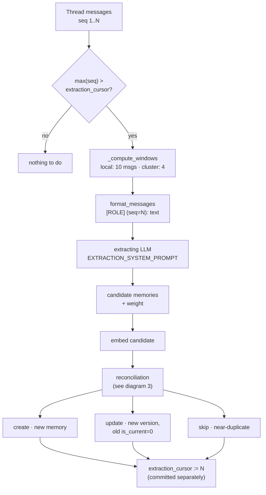
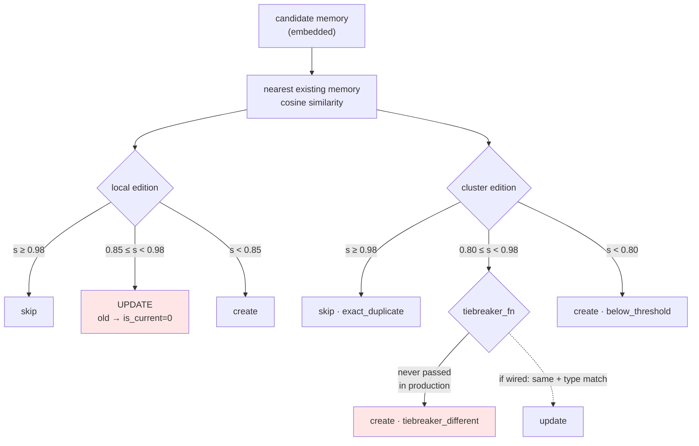
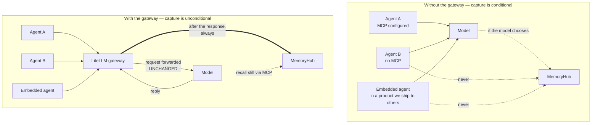
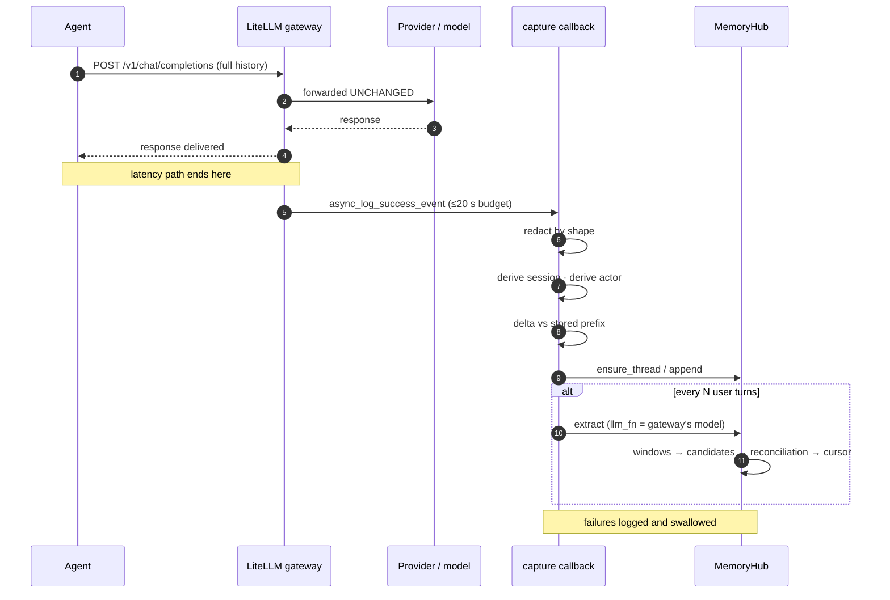
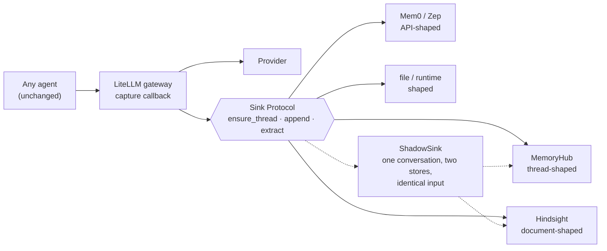

# MemoryHub + LiteLLM gateway capture — the complete picture

*Kateryna Romashko · compiled 2026-10-01 · branch `feat/wrig-1482-litellm-proxy-capture`*

---

## 1. What this document is, and how to read it

This is the single place where everything we know about this work is written down:
what problem it solves, how MemoryHub's memory write path actually works today,
what the gateway PoC adds, what two full demo runs measured, and what is still
unknown. It replaces the scattered set — the deck, the one-pager, the two demo
scenarios, the run logs — as the thing to read first.

The test for whether it is good enough: after reading it you should be able to
explain to another engineer, without opening the code, *"here is the problem we
are solving, here is how MemoryHub works now, here is why we want a gateway, and
here is what we have actually proved."*

Two rules were applied while writing it.

**Nothing is invented.** Every number comes from a named run log or a named file
and line. Where something is a design intention rather than a measurement, it says
so. Where it is a guess, it says it is a guess.

**Everything is labelled.** The labels are defined in section 2 and used
throughout. If a claim has no label it is a definition or a restatement of
something labelled earlier.

Sections 3–5 are the overview. Sections 6–13 are how MemoryHub works today —
this is the part most people on the team have never read in one piece. Sections
14–20 are the gateway. Sections 21–24 are evidence. Sections 25–29 are what to do
next and what we do not know.

---

## 2. Evidence levels used in this document

| Label | Means | How it can be checked |
|---|---|---|
| **CONFIRMED** | Read directly in the code on this branch. File and line given. | Open the file. |
| **OBSERVED** | Seen in one of the two full demo runs. Run and step given. | `demo-run-1.md`, `demo-run-2.md` in `demos/litellm-proxy-capture/`. |
| **DESIGN** | Intended behaviour, written in code or docs as the plan, but never exercised in a run we have logs for. | Code exists; evidence of it running does not. |
| **HYPOTHESIS** | My inference from the above. Plausible, unverified. | Would need a specific experiment, named where possible. |
| **OPEN QUESTION** | Not known, and we have not yet decided how to find out. | Collected in section 27. |

One distinction matters more than the others and is easy to blur:
**CONFIRMED is not OBSERVED.** We can read in the cluster code that a certain
branch always fires, and still never have watched it fire, because we have no
cluster to run against. Both are evidence. They are not the same evidence, and a
claim that mixes them is the kind of claim that gets taken apart in a review.

---

## 3. The problem, in plain language

A memory system is only as good as what reaches it. Today a conversation reaches
MemoryHub when **two separate things both happen**:

1. Somebody configured that agent with the MemoryHub MCP server, and
2. the model, mid-conversation, chose to call the memory tool.

Both are real conditions, and both fail quietly.

**Configuration is possible but not centralisable.** Codex and Claude Code both
accept MCP servers and plugins; several memory vendors ship installers for exactly
that. So "we cannot configure our agents" is false and we should not say it. What
is true is that the configuration is **per agent, per developer, per machine**. A
platform team cannot switch it on for everyone, cannot see who has it, and cannot
tell when a reinstall or an upgrade silently dropped it. Agents embedded in
products we do not ship cannot take it at all.

**Capture is model-elective.** Even fully configured, writing happens only if the
model decides to call the tool. When it does not, the conversation is not
remembered, and — this is the part that hurts — nothing records that it happened.
There is no gap in the data to notice. The memory simply does not exist.

So the thing we want is narrow:

> **Writing memory should be infrastructure. Reading it should stay a decision.**

Capture every conversation that passes through the gateway, unconditionally,
without asking any agent to change. Keep retrieval exactly where it is — in MCP,
chosen by the model, because only the model knows when it needs to remember
something. Mutations (update, correct, forget) stay in MCP too: those are
decisions, not observations.

The analogy that lands with platform people: a service mesh. Nobody asks each
application to emit mTLS and traces; the layer underneath does it uniformly and
the platform team enables it once. The application still writes its own business
logic. **Capture is the mesh telemetry. Deciding what to recall is the business
logic.**

---

## 4. Timeline: how this work got here

Reconstructed from commits, file dates and the project docs. Dates without a
commit behind them are marked approximate.

| When | What happened | Trace |
|---|---|---|
| 2026-09-18 | PoC lands on the branch: a LiteLLM `CustomLogger` that captures conversations into MemoryHub threads. Two commits: the PoC, then hardening for the local edition. | `d97360d`, `52d8a8e` |
| late Sept (approx.) | Research round: is anyone using a gateway as the memory integration point? Answer: effectively nobody for capture; the handful of "memory proxies" that exist do *injection*, which is the expensive half. | project doc `2026-09-25-agentic-memory-pov-analysis.md` |
| late Sept (approx.) | Research drift and correction. The first report had drifted into "the proxy selects memory", which is not the proposal. Re-answered as: why do other systems reach for hooks or MCP and not a gateway. | project docs; §14 here |
| late Sept (approx.) | Attempt to carry the argument in a Red Hat-templated deck. Abandoned after two rebuilds — the narrative did not survive the slide format. Replaced by one long document, `capture-at-the-gateway.md`. | project docs `capture-at-the-gateway.md`, `.ru.md` |
| late Sept (approx.) | Milestone review meeting. Sanjeev's objection recorded: MCP already solves this; a proxy is expensive. One-pager written to answer it directly. | project doc `gateway-capture-one-pager.md` |
| 2026-09-30 | **Demo run 1.** Five use cases end to end on the personal edition. Extraction, reconciliation, hybrid defer, re-extraction. | `demo-run-1.md` |
| 2026-09-30 | **Demo run 2.** Redaction on, shadow fan-out to Hindsight, two actors, real Codex, `/v1/messages` probed. | `demo-run-2.md` |
| 2026-09-30 | Three defects found *in my own PoC code* by those runs, two fixed the same day: a wrong import in `facts.py`, double-counted redactions in `verify.py report`, and the session-lock bug that silently lost a turn. | §22, §23 |
| 2026-10-01 | Full code read of MemoryHub's own write path (local and cluster) to put the PoC in context rather than describe it in isolation. This document. | §6–§13 |

Two things to notice about that timeline. First, the PoC code has been on the
branch since 18 September and the two commits there are the *only* commits — the
redaction module, the sink protocol, the live tooling and the tests written since
are all still uncommitted working tree. Second, the demo runs are two days old;
every number in section 21 comes from them and nothing has been re-measured since
the lock fix.

---

## 5. MemoryHub today: the two editions, in one breath

There are two implementations and they are not variants of one codebase. Knowing
which one a statement is about is the single biggest source of confusion in this
area.

| | **Personal / local edition** | **Cluster edition** |
|---|---|---|
| Package | `memoryhub-local/` | `src/memoryhub_core/` + `memory-hub-mcp/` |
| Store | SQLite | Postgres, large content to S3 |
| Embeddings | ONNX, `granite-embedding-small-english-r2`, in-process | Service-side (TEI) |
| Conversation extraction | `memoryhub_local/services/extraction.py` | `memoryhub_core/services/dreaming.py` |
| Reconciliation | inside `extraction.py` | `memoryhub_core/services/reconciliation.py` |
| Ownership | `TENANT_ID = "local"`, owner = OS user | real tenant and agent identity |
| What the demos ran on | **this one** | never, in any run we have logs for |

CONFIRMED (`memoryhub-local/src/memoryhub_local/identity.py`): the local edition
hardcodes `TENANT_ID = "local"` and derives the owner from `os.getlogin()` or
`$USER`. That is a different thing from the `observed_actor_id` the gateway
records, and the two should not be conflated — see §16.

A trap worth naming now: `src/memoryhub_core/services/extraction.py` **is not**
the cluster's conversation extraction. CONFIRMED by reading it: it is
entity/NER-style extraction over documents. The cluster's conversation→memory path
is `services/dreaming.py`. Anyone who greps for "extraction" in the cluster tree
and reads the first hit will come away with the wrong model of the system.

---

## 6. Diagram 1 — how memory is written today



Read the two conditions off the diagram: the dotted box must exist, and the thick
arrow must be chosen by the model. Everything downstream of the thread is
automatic and works well. The fragility is entirely in those two steps.

---

## 7. Dreaming, in depth — what it actually is

"Dreaming" is the name for the step that turns a *conversation* into *memories*.
It is not retrieval, not summarisation of the whole thread, and not a background
daemon. It is a pass over the messages that have arrived since the last pass.

The pieces, in order:

**1. The cursor.** Each thread carries an `extraction_cursor` — the sequence
number of the last message that has been through extraction. CONFIRMED
(`memoryhub-local/.../services/extraction.py`): `get_pending_threads` selects
threads where `max(sequence_number) > extraction_cursor`. That is the entire
definition of "there is something to dream about".

**2. Windows.** The pending messages are cut into windows. CONFIRMED: local
`_DEFAULT_WINDOW_SIZE = 10` (`extraction.py:75`); cluster
`conv_extraction_window_size = 4` (`src/memoryhub_core/config.py:84`). The cluster
additionally supports window modes — `per_session`, `per_message`, `per_turn` —
in `_compute_windows` (`memoryhub_core/services/dreaming.py`). The two editions
therefore show the extracting model **different amounts of context by default**,
which alone is enough to make their outputs differ.

**3. Rendering.** `format_messages` turns a window into plain text lines of the
form `[ROLE] (seq=N): text`. CONFIRMED. Nothing else — no tool calls, no
reasoning blocks — reaches the model at this point.

**4. The extracting model.** A prompt (`EXTRACTION_SYSTEM_PROMPT`,
`extraction.py:43`) asks for "facts, preferences, decisions, and knowledge that
are worth remembering". CONFIRMED, and worth flagging: **the same prompt text
exists twice** — once inline at `extraction.py:43` and once in
`prompts/conversation_extraction.yaml`. Two copies, no shared source. Changing one
does not change the other.

**5. Candidates.** The model returns candidate memories with a weight. They are
not stored yet.

**6. Reconciliation.** Each candidate is compared against what is already stored
and becomes a `create`, an `update` or a `skip`. This is section 10.

**7. The cursor moves.** CONFIRMED (`extraction.py:505` sets it, `:509` commits).

Two consequences of that last step deserve their own line.

**Dreaming is not scheduled.** CONFIRMED by absence: there is no scheduler, timer
or worker anywhere in either tree that calls extraction on its own. Something must
trigger it. Section 9 lists what can.

**The cursor and the memories are committed separately.** CONFIRMED:
`memoryhub-local/.../services/memory.py:77` commits each created memory
immediately, while the cursor is committed at `extraction.py:509`. If the process
dies between them, the memories exist and the cursor has not moved — the same
window is dreamt again on the next pass. In practice reconciliation then sees
similarity 1.0 and skips, so the visible damage is small; OBSERVED in run 1, where
a re-extraction of the harness thread returned `extracted_count=0` with two
`skip  score=1.000  reason: near-duplicate` decisions rather than two duplicates.
That is the system's saving grace, not its design: the write is not atomic, and
the deduplication at 0.98 is what covers for it.

---

## 8. Diagram 2 — the dreaming pipeline



---

## 9. The three places extraction is triggered today

Nothing runs dreaming on a timer. These are the triggers that exist. CONFIRMED,
all three.

**A. On MCP connect.** `memoryhub-local/.../tools/register_session.py` drains
pending threads when a session registers — `_DREAMING_TIMEOUT = 30.0`,
`_MAX_DRAIN_DEFAULT = 3` threads per connect. The extracting model is the
**client's own model**, reached through MCP sampling (`ctx.sample`).

**B. On explicit tool call.** `memoryhub-local/.../tools/thread.py:192`,
`_do_extract`. Also `ctx.sample`. With no `thread_id` it processes all pending
threads.

**C. Cluster side.** `memory-hub-mcp/src/tools/thread.py:468,524` triggers the
cluster's extraction path.

This is a genuinely important finding and it corrects something I believed
earlier. The question "who actually runs deferred dreaming?" has an answer:
**the next MCP connect does**, up to three threads, with a 30-second budget, using
the connecting client's model for the extraction. It is not abandoned work.

It also has a shape worth stating plainly: **extraction is paid for by whoever
connects next**, in their tokens, on their model, inside a 30-second timeout. If
nobody connects, nothing is extracted. If a thread is the fourth in the queue, it
waits.

The PoC's relationship to this is the subject of §17, and it is not what I assumed
at the start.

---

## 10. Reconciliation — how a new fact meets the old ones

A candidate memory is embedded and compared to the nearest existing memory. What
happens next depends on the similarity score, and **the two editions decide
differently**.

**Local edition.** CONFIRMED, `memoryhub-local/.../services/extraction.py:73-74`,
branch at `:201-204`:

- `similarity >= 0.98` → **skip** (near-duplicate)
- `similarity >= 0.85` → **update** — a new version is written and the old one
  gets `is_current = 0`
- otherwise → **create**

**Cluster edition.** CONFIRMED, `src/memoryhub_core/services/reconciliation.py:35-36`
and the branch at `:120-153`:

- `nearest_score >= 0.98` → **skip**, reason `exact_duplicate`
- `0.80 <= nearest_score < 0.98` → a **tiebreaker** is supposed to run: an LLM is
  asked whether the two texts are the *same* fact. If it says `same` and the
  content types match → **update**. Otherwise → **create**.
- below 0.80 → **create**, reason `below_threshold`

And here is the finding that matters most in this section. CONFIRMED by searching
the whole tree: `tiebreaker_fn` is an optional parameter
(`reconciliation.py:90`, default `None`) and **no production code ever passes
it**. The only callers that pass a tiebreaker are
`tests/test_services/test_rollback.py:104,282`. With `tiebreaker_fn=None` the
`verdict` stays `None`, so the branch at `:150` falls through to
`result.action = "create"`, `reason = "tiebreaker_different"`.

Stated carefully, because this is exactly the kind of claim that gets challenged:

> In the cluster code as it stands, every candidate scoring between 0.80 and 0.98
> against an existing memory is **created as a new memory**, not merged — because
> the tiebreaker that was designed to make that call is never wired up.
> **CONFIRMED by code inspection. NOT OBSERVED** — we have no cluster run.

Each decision is recorded in `reconciliation_decisions` with the action,
similarity score, nearest match id, reason and tiebreaker verdict. That table is
what makes any of this auditable, and it is what the demo reads with
`peek.py decisions`.

---

## 11. Diagram 3 — reconciliation, local vs cluster



Read the two red boxes together and the practical difference is this: **the local
edition over-merges and the cluster edition over-creates.** They fail in opposite
directions, from the same input, and neither failure is visible unless you read
`reconciliation_decisions`.

---

## 12. Local vs cluster — the differences that actually change behaviour

| Dimension | Local | Cluster | Why it matters |
|---|---|---|---|
| Window size | 10 messages (`extraction.py:75`) | 4 messages (`config.py:84`) | Different context → different facts extracted from the same conversation. |
| Merge band | update at ≥ 0.85 | create below 0.98 (tiebreaker unwired) | Opposite failure modes, §10–11. |
| Tiebreaker | none by design | exists, never called | §10. |
| Window modes | single mode | `per_session` / `per_message` / `per_turn` | Cluster can be tuned; local cannot. |
| Large content | all inline in SQLite | `conv_inline_max_bytes = 8192` → S3; `s3_threshold_bytes = 102400`; `s3_prefix_chars = 1000` kept inline for ranking | A long message is stored differently, and search ranks on the prefix. |
| Extraction model | whoever connects (`ctx.sample`), or an injected `llm_fn` | cluster-side configuration | §17. |
| Identity | `TENANT_ID = "local"`, OS user | real tenant / agent identity | The local demo cannot demonstrate multi-tenant isolation. |
| Evidence we have | two full runs | **none** | Every number in §21 is local-edition only. |

The last row is the one to say out loud in any review. **No cluster numbers exist
in this work.** Anything presented as a MemoryHub measurement is a measurement of
the personal edition with ONNX `granite-embedding-small-english-r2` embeddings and
`qwen2.5:7b` as the extracting model, over Ollama, on one laptop.

---

## 13. Single source of truth — the constants, and where they live

Keep this table; it is the thing people will come back for.

| Constant | Value | Where | Edition |
|---|---|---|---|
| skip threshold | `0.98` | `memoryhub-local/.../services/extraction.py:73` | local |
| update threshold | `0.85` | `…/extraction.py:74` | local |
| window size | `10` | `…/extraction.py:75` | local |
| extraction prompt | inline | `…/extraction.py:43` | local |
| extraction prompt (copy) | file | `prompts/conversation_extraction.yaml` | both? — §27 |
| cursor set / commit | `:505` / `:509` | `…/extraction.py` | local |
| memory commit | immediate | `memoryhub-local/.../services/memory.py:77` | local |
| tenant id | `"local"` | `memoryhub-local/.../identity.py` | local |
| owner id | `os.getlogin()` or `$USER` | `…/identity.py` | local |
| dreaming timeout on connect | `30.0 s` | `…/tools/register_session.py` | local |
| threads drained per connect | `3` | `…/tools/register_session.py` | local |
| skip threshold | `0.98` | `src/memoryhub_core/services/reconciliation.py:35` | cluster |
| tiebreaker threshold | `0.80` | `…/reconciliation.py:36` | cluster |
| tiebreaker function | `None` in production | `…/reconciliation.py:90` | cluster |
| conversation window size | `4` | `src/memoryhub_core/config.py:84` | cluster |
| inline message limit | `8192 B` | `…/config.py:78` | cluster |
| S3 threshold | `102400 B` | `…/config.py:72` | cluster |
| extraction trigger | `memory-hub-mcp/src/tools/thread.py:468,524` | — | cluster |
| logging worker budget | `20 s` per coroutine | LiteLLM `LOGGING_WORKER_MAX_TIME_PER_COROUTINE` | gateway |
| capture lock wait | `8 s` (`MEMORYHUB_CAPTURE_LOCK_TIMEOUT`) | `memoryhub_capture.py` | gateway PoC |

All CONFIRMED by reading the files on this branch on 2026-10-01.

---

## 14. Why does nobody else put memory at the gateway?

This was the original question, and it is worth answering properly because
"nobody does it" is the first thing a skeptic reaches for.

What the research round found: of the gateways (LiteLLM, Portkey, Helicone,
Cloudflare AI Gateway, Kong AI Gateway, OpenRouter) and the memory systems (Mem0,
Zep, Letta, Hindsight, Cognee, Supermemory, Graphiti, MemoryOS), the ones that do
touch the proxy layer do **injection** — rewriting the prompt to add remembered
context. Capture-at-the-gateway as the integration point is essentially unused.

Seven reasons, with the evidence level for each:

1. **Their product is injection, and injection at the proxy is the expensive
   half.** Changing the prompt prefix invalidates the provider's cache. With
   Anthropic pricing a cache read is 0.1× and a cache write 1.25× of base input;
   a memory block injected ahead of a long static prefix turns every call into a
   cache miss. The rule of thumb that falls out — *static first, dynamic last* —
   is exactly what prompt-layer injection violates. HYPOTHESIS as a motive;
   the pricing is public fact.
2. **The gateway sees the wire, not the work.** A proxy observes messages. It does
   not see that a file was written, a test failed, or an approval was given,
   except as whatever the agent chose to put in the transcript. For a product that
   wants rich episodic memory, the agent process is a better vantage point.
   HYPOTHESIS.
3. **Their distribution channel is the individual developer.** Memory vendors ship
   installers for Claude Code and Codex because that is who buys. A per-machine
   MCP install is not a weakness in that market — it *is* the go-to-market. The
   centralisation problem only appears when the customer is a platform team.
   HYPOTHESIS, and the one I believe most.
4. **MCP gives the model agency; a proxy cannot.** A tool call can ask, confirm,
   disambiguate. A callback cannot. For *reading*, that agency is the whole value
   — which is why we are not proposing to move reading.
5. **Conversation identity is not in the protocol.** The OpenAI and Anthropic wire
   formats carry no session id. Any gateway must infer it. We infer it too, and it
   is a real limitation (§26).
6. **The feedback loop.** If a proxy injects memory into the prompt and also
   captures the prompt, it re-captures its own injections and the store degrades.
   Capture-only avoids this entirely; injection-plus-capture needs careful
   filtering. HYPOTHESIS as a reason others avoid it; mechanically obvious.
7. **Organisational.** The gateway is operated by the platform team; memory is
   bought by the application team. An integration that spans both has no natural
   owner at most companies. HYPOTHESIS.

The shape of the answer: **the reasons others avoid the proxy are reasons against
injection and reasons about their market — not reasons against capture.** We are
proposing the half that is cheap, in an organisation that happens to own the
gateway. That is the whole argument, and it is narrower and more defensible than
"the proxy is the right place for memory".

---

## 15. Diagram 4 — with and without the gateway



The two properties the right-hand side buys: capture becomes **central** (one
place to enable, audit and switch off) and **unconditional** (it does not depend
on a model's choice). Nothing else changes: the request reaches the provider
byte-for-byte as it arrived, so the provider cache is untouched, and recall is
still the model's decision through MCP.

---

## 16. What the PoC actually is, component by component

All of this lives in `demos/litellm-proxy-capture/`.

**`memoryhub_capture.py`** — a LiteLLM `CustomLogger`. The only hook that matters
is `async_log_success_event`, which fires **after** the response has gone back to
the client. Capture therefore cannot add latency to inference and cannot break a
request; a failure in the callback is logged and swallowed. The budget it lives
inside is LiteLLM's `LOGGING_WORKER_MAX_TIME_PER_COROUTINE`, 20 seconds — a number
that turned out to matter a great deal (§22).

**Session derivation.** In order: the `X-MemoryHub-Session` header, then LiteLLM's
own session id, then a fingerprint of the first user message. OBSERVED in run 2:
15 of 16 calls resolved by header, 1 by fingerprint (the raw `curl`, which sent no
header).

**Actor derivation.** OBSERVED in run 2: 10 calls by virtual-key user, 6 by
header. This is the gateway's view of *who was talking* and is deliberately
separate from MemoryHub's own `owner_id`, which in the local edition is the OS
user (§5).

**Delta capture.** Clients resend the whole conversation every turn. The handler
computes the longest common prefix against what it already stored and appends only
what is new; if the prefix does not match, it records `history_rewritten`.
OBSERVED in run 2: 22 messages appended across 16 calls, `history rewrites: 0`.

**`redact.py`** — nine shape-based rules (private key, AWS access key id, GitHub
token, Slack token, OpenAI key, Google API key, JWT, URL credentials, bearer
token, generic secret assignment). Each match becomes `[redacted:{rule}]`.

The ordering here is the part that is easy to get wrong and was got right:
redaction runs **before** session derivation, so a secret never enters the
fingerprint hash, and before anything is written, so raw values never reach the
store. OBSERVED in run 2: 32 redactions counted over the run, `aws_access_key_id`
16 and `github_token` 16, and the stored text and the model's own echoed reply
both contain the placeholder — the file on disk has no raw value in it.

**`sinks.py`** — the Sink Protocol: `ensure_thread` / `append` / `extract`. Three
methods. Everything that is MemoryHub-specific lives behind them.

- `LocalSink` writes to the personal edition.
- `HindsightSink` maps the same three calls onto Hindsight's bank/document model
  (`document_id = proxy-{session.key}`), buffering locally and POSTing the whole
  rendered conversation on `extract`.
- `ShadowSink` fans one live conversation out to two stores at once. The primary
  governs; shadow failures are logged and dropped.

**`live/facts.py`** — scores a run against a written ground truth in `facts.json`,
and scores **extraction, preservation, retrieval, precision and leakage
separately**, naming the merge that retired each lost fact. This separation is the
reason the numbers in §21 are worth anything: a single "accuracy" number would
hide the fact that preservation, not extraction, is where MemoryHub loses facts.

**`verify.py`**, **`live/peek.py`**, **`live/watch.py`** — read-only inspection of
observations, threads, memories and reconciliation decisions.

---

## 17. Where does extraction happen? — the question, answered

This was open for a long time and the answer turned out to be better than I
expected.

The worry was that the PoC would become a **third** implementation of
conversation extraction, alongside the local edition's and the cluster's. Three
implementations of the same thing, drifting apart, is how a codebase rots.

CONFIRMED by reading the code: it does not. The PoC calls MemoryHub's **existing**
`extract_from_thread` and injects a different `llm_fn` — the extracting model the
gateway is configured with (in both runs, `qwen2.5:7b` over Ollama). The windowing,
the prompt, the candidate parsing, the reconciliation, the cursor — all of it is
MemoryHub's own code, unchanged.

So the correct mental model is: **there is one extraction implementation per
edition, and three ways to supply the model that runs it.**

| Trigger | Who supplies the extracting model | Where |
|---|---|---|
| MCP connect (drain ≤3 threads, 30 s) | the connecting client, via `ctx.sample` | `tools/register_session.py` |
| Explicit `extract` tool call | the calling client, via `ctx.sample` | `tools/thread.py:192` |
| **Gateway PoC** | the gateway's configured model, via injected `llm_fn` | `memoryhub_capture.py` |

That matters for the cost argument more than anything else in this document.
Extraction in the PoC ran **locally, on Ollama** — so the memory side of the
demos cost **zero provider tokens**. The same pass triggered through MCP sampling
would have been billed to whoever connected, on their model. These are not
equivalent architectures with a different trigger; they have different payers.

---

## 18. Diagram 5 — one request through the PoC



The line to point at in a review is the "latency path ends here" note. Everything
below it is off the critical path by construction, not by tuning.

---

## 19. Memory-system agnosticism — why the Sink Protocol is the interesting part

The three methods — `ensure_thread`, `append`, `extract` — are a claim: that the
*capture* side of a memory system is small and uniform, even though the *storage*
side is not. Memory systems come in at least four shapes:

- **thread-shaped** (MemoryHub): conversations, then extraction over them.
- **document-shaped** (Hindsight): banks of documents, retention does the work.
- **file-shaped**: markdown the agent reads and rewrites.
- **runtime-shaped** (Letta-style): memory as part of the agent's own state.

OBSERVED in run 2: one live conversation was fanned out to MemoryHub and Hindsight
simultaneously, through the same three methods, with identical input. That is the
thing no SDK integration can do, and it is the direct answer to the benchmarking
problem Ray has: running one task twice against two memory systems does not
compare them, because memory changes the agent's replies — by the second turn you
are comparing two different conversations. Fanning one conversation out to both
stores compares them on identical input.

---

## 20. Diagram 6 — the gateway as a memory-agnostic layer



---

## 21. The experiment — two full runs, real numbers

Both runs: **personal edition**, SQLite, ONNX `granite-embedding-small-english-r2`
embeddings, extracting model `qwen2.5:7b` over Ollama at `localhost:11434`,
`extract_every=2` user turns, one laptop, 2026-09-30. Logs: `demo-run-1.md`,
`demo-run-2.md`.

### Run 2, the headline counters

```
calls observed: 16   captured: 16   skipped: 0
session source: {'header': 15, 'end_user_fingerprint': 1}
actor source:   {'virtual_key_user': 10, 'header': 6}
sessions: 4      history rewrites: 0      messages appended: 22
credentials redacted: 32 {'aws_access_key_id': 16, 'github_token': 16}
errors: 0
extractions: 5   memories: 13   failed windows: 0   circuit breaker: 0
extraction call ms: avg=31334  max=39407
```

OBSERVED. Read them in order:

- **16 of 16 captured, 0 skipped, 0 errors.** Capture itself did what it claims.
- **22 messages appended, 0 history rewrites.** Delta capture held across four
  sessions and two actors.
- **Extraction 31 s average, 39 s worst.** This is the number that caused the
  worst defect of the run (§22), and it is a property of `qwen2.5:7b` on a laptop,
  not of the architecture. Run 1, without the shadow fan-out, averaged roughly
  6–12 s for the same windows.
- **Zero provider tokens on the memory side**, because extraction ran on Ollama.

### Fact scoring, run 2 (`live/facts.py` against `facts.json`)

| | MemoryHub (local) | Hindsight (shadow) |
|---|---|---|
| extraction — expected facts that reached the store | **6/6** | 5/6 |
| preservation — still the current version | **5/6** (1 retired by a merge) | — |
| retrieval — expected fact returned | not scored (see below) | **5/5, all rank 1** |
| precision — ungrounded results | — | **0** |
| leakage — watched credentials in the store | **none** | **none** |
| memories stored | 8 (5 current, 3 retired) | 10 |

The retrieval number for MemoryHub is missing from that run for an unflattering
reason: `facts.py --search` crashed on an import I wrote wrong
(`memoryhub_local.services.recall`; the function lives in `services.memory`). The
import is fixed; the number has not been re-measured. It is **OPEN**, not zero.

### Reconciliation decisions, run 2 — the four updates

| similarity | what replaced what | verdict |
|---|---|---|
| 0.8612 | AWS key fact → registry token fact | **wrong** — both were in the same user message |
| 0.8749 | "docs by Friday" → "v2 compatibility" | **wrong** |
| 0.8696 | backend Go → Rust | right |
| 0.8747 | Airflow+Snowflake → nightly job deadline | **wrong** |

Run 1 showed the same pattern independently: Friday→v2 at **0.8819** (wrong),
Go→Rust at **0.8514** (right), Airflow+Snowflake→"advice about DAGs" at **0.8671**
(wrong).

> **The correct merge scored lower than every incorrect one, in both runs.**
> OBSERVED, twice. This is not a threshold that needs tuning up or down — at 0.85
> the band contains both kinds of pair, and no single number separates them. It is
> the empirical case for the tiebreaker that the cluster code already has and does
> not call (§10).

### Other measured behaviour

- **Hybrid policy.** OBSERVED run 1: when the agent wrote memories itself, the
  handler logged `agent wrote 1 memory/memories itself; extraction deferred
  (agent_wrote:1)` and did not double-extract. The `defer | extract | skip-thread`
  policy works as specified.
- **What is stored.** OBSERVED run 1: the captured transcript contains no
  `<system-reminder>`, no thinking blocks, and no `tool_use` / `tool_result`.
- **Noise.** OBSERVED run 1: a recipe for boiling an egg was stored, at weight
  0.6, which nobody "decided". "Thanks!" was correctly filtered out.
- **Unbounded search.** OBSERVED run 1: a search with no cutoff returned all 7
  current memories for both "backend language" and "data warehouse" — top score
  0.8337, bottom 0.7333, the egg recipe included. Scoring works; cutting off does
  not happen.
- **Re-extraction is safe.** OBSERVED run 1: rewinding the cursor and re-running
  produced `extracted_count=0` with two `skip score=1.000` decisions, not two
  duplicates.
- **`/v1/messages` — the open blocker, closed.** OBSERVED run 2: a raw `curl` to
  `/v1/messages` with `anthropic-version: 2023-06-01` returned 200 and **the
  success hook fired**; the conversation landed in a thread, session resolved by
  fingerprint. The endpoint Claude Code uses is captured by this LiteLLM version.
- **Tests.** OBSERVED run 2: `48 passed`.

---

## 22. Surprises — what did not behave as expected

**1. The session lock swallowed a turn, silently.** OBSERVED run 2, Bob's third
message. The previous turn's extraction plus shadow fan-out held the per-session
lock for 28 seconds. The next callback queued on that lock and was cancelled by
LiteLLM's 20-second logging-worker budget. The client saw a perfectly successful
HTTP response — the agent printed its answer — and the turn never reached the
thread. `verify.py threads` showed `team-bob messages=4 cursor=4`.

This is the most important defect found in the whole exercise, because the failure
is **invisible from the outside**: no error to the user, no gap in the agent's
behaviour, just a missing message. It is exactly the class of bug that would
destroy trust in capture if it reached production.

Fixed: capture and extraction now take **separate locks**, the capture lock is
acquired with a bounded wait (`MEMORYHUB_CAPTURE_LOCK_TIMEOUT`, default 8 s), a
timeout produces a visible `capture_lock_busy` observation instead of silence, and
a regression test (`test_a_running_extraction_does_not_block_the_next_call`) holds
the line. **Not yet re-measured in a full run.**

**2. Codex failed, but not where we predicted.** OBSERVED run 2. Real Codex
(`codex-cli 0.155.0-alpha.2.6`, found inside `ChatGPT.app`, config untouched,
provider set with one-shot `-c` flags) reached the gateway — the banner showed
`provider: memoryhub-proxy` — and then every `POST /v1/responses` returned 500
with `TypeError: unhashable type: 'dict'`. Codex sends reasoning effort as a dict;
LiteLLM's Ollama adapter expects the string `low|medium|high` and raises before
the call. The success callback never fires, so there is no capture.

The honest reading: on this pairing, zero-touch capture **did not happen**. But the
cause is parameter mapping between Codex and the Ollama adapter on `/v1/responses`
— not a missing hook, and not the `/v1/messages` question, which passed. The
limitation is "each new API shape is new normalisation work", which we already
knew; it is not "the gateway cannot see agent traffic".

**3. The redaction counter was lying, and the store was not.** OBSERVED run 2:
`verify.py report` showed `credentials redacted: 32` while the per-call log line
said `REDACTED=4`. Two causes compounding: the client resends the raw history
every turn so the rule fires again each time, and my `report` summed both the call
observation *and* the extraction observation for the same redaction. The store
itself was clean throughout — no raw value ever written. `report` now filters to
`event in (None, "call")` and prints the resend caveat.

**4. On-connect dreaming exists.** CONFIRMED (§9). I had assumed deferred
extraction was effectively never run, because nothing schedules it. It is run — by
the next MCP connect, three threads at a time, 30-second budget, on the connecting
client's model. This changes the fair comparison: the alternative to gateway-side
extraction is not "nothing happens", it is "someone else pays for it later".

**5. The cluster tiebreaker is dead code.** CONFIRMED (§10). Designed, implemented,
tested — and never wired into the production path.

**6. The extraction prompt exists twice.** CONFIRMED (§7): `extraction.py:43` and
`prompts/conversation_extraction.yaml`, same text, no shared source.

---

## 23. Contradictions — where my earlier understanding was wrong

Stated in the form *earlier understanding → new evidence → corrected
understanding*, because several of these were asserted in documents that are still
circulating.

**A. "Codex and Claude Code cannot be configured with memory."**
→ Both accept MCP servers and plugins, and vendors ship installers for exactly
that.
→ **Corrected:** they *can* be configured; the configuration is per agent, per
developer, per machine. It cannot be enabled centrally, cannot be audited, and
disappears silently on a reinstall. And once enabled, capture still depends on the
model choosing to call the tool. Both the one-pager and the long document now say
this; anything older that says otherwise is wrong.

**B. "The cluster produces duplicates."**
→ Flagged earlier as an unsupported claim, and I removed it. Code inspection on
2026-10-01 found that `tiebreaker_fn` is never passed outside tests, so the
0.80–0.98 band always resolves to `create · tiebreaker_different`.
→ **Corrected:** the claim is **CONFIRMED by code inspection** and **NOT
OBSERVED** — we have no cluster run. It must always be stated with both labels.
Saying "we measured duplicates in the cluster" would be false.

**C. "Nobody runs deferred dreaming, so pending threads just accumulate."**
→ `register_session.py` drains up to three pending threads on every MCP connect,
30-second timeout, extracting with the connecting client's model.
→ **Corrected:** deferred dreaming does run; it runs on connect, bounded, and it
is paid for by whoever connects next.

**D. "The PoC will need its own extraction implementation."**
→ It injects a different `llm_fn` into MemoryHub's existing `extract_from_thread`.
→ **Corrected:** one implementation per edition, three ways to supply the model.
No third implementation exists and none should be written.

**E. "Capture is cheap because extraction is cheap."**
→ Extraction averaged 31 s in run 2 and the 28-second hold caused a lost turn.
→ **Corrected:** capture is cheap *and off the latency path*; extraction is slow
and must never share a lock with capture. The architecture was fine; my
implementation of it was not, until it was fixed.

**F. "The proxy is where memory selection should happen."**
→ This was drift in the first research report, and it is not the proposal.
→ **Corrected:** the proxy writes. MCP reads, and MCP mutates. The proxy never
touches the prompt.

---

## 24. Before / After

| | Without the gateway | With the gateway (as built) |
|---|---|---|
| What gets captured | whatever the model chose to save | every call through the gateway |
| Who must act | each developer, on each machine, per agent | the platform team, once |
| Visibility of gaps | none — a missed memory leaves no trace | `observations` records every call, captured or skipped, with a reason |
| Agents in products we do not ship | cannot participate | participate, unchanged |
| Latency added to inference | none | none — capture runs after the response |
| Provider prompt cache | untouched | untouched — the request is forwarded byte-for-byte |
| Who pays for extraction | whoever connects next (their model, via `ctx.sample`) | the gateway's configured model — in the demos, local Ollama, 0 provider tokens |
| Secrets in the store | whatever the agent wrote | redacted by shape before storage *and* before hashing |
| Comparing two memory systems | impossible on identical input | one conversation, fanned out to both |
| Retrieval | model decides, via MCP | **unchanged** — model decides, via MCP |

The last row is the one that gets forgotten in every retelling. Nothing about
reading changes.

---

## 25. What is safe to claim, and what is not

**Safe to say.**

- Capture at the gateway works with no agent-side changes: 16/16 calls captured,
  0 errors, across four sessions and two actors. OBSERVED.
- It adds no latency to inference and cannot break a request, by construction —
  the hook fires after the response is delivered. CONFIRMED + OBSERVED.
- It does not touch the prompt, so the provider cache is unaffected. CONFIRMED.
- Credential redaction by shape works, before storage and before hashing, with no
  raw value reaching the store. OBSERVED.
- One live conversation can be written to MemoryHub and Hindsight at once, on
  identical input. OBSERVED.
- The hook fires on `/v1/messages`. OBSERVED.
- Extraction reuses MemoryHub's own code path. CONFIRMED.

**Not safe to say, and why.**

- *Anything about the cluster from measurement.* Every number is personal edition.
- *"Zero token cost."* Zero **provider** tokens on the memory side, because
  extraction ran on local Ollama. The agent-side overhead has not been measured
  and the review asks for it.
- *"Any agent, unchanged."* Codex over `/v1/responses` did not work on this stack.
  Say "any agent speaking an API shape the gateway normalises", and name the gap.
- *"Capture is reliable."* It lost a turn two days ago. The fix is in and tested;
  a full run has not re-confirmed it.
- *"Extraction quality is good."* 6/6 extracted, but 3 of 4 merges were wrong.
  Extraction is not the weak point; **preservation** is.
- *Anything with a vendor's headline number attached.* The one "30+ points" figure
  we nearly used traces to a single vendor-affiliated source and should not be
  repeated.

---

## 26. Risks being carried, stated plainly

1. **Session identity is inferred.** Without `X-MemoryHub-Session` the gateway
   fingerprints the first user message. It collides on identical openings and
   splits when a client compacts its history. OBSERVED: one call out of 16 fell
   back to fingerprint, correctly, but the failure modes are real.
2. **Every new API shape is new normalisation work.** §22, finding 2.
3. **Capture writes into MemoryHub *threads*.** If threads are being deprecated,
   the write path needs a new target. This matters more to the work than the proxy
   question does, and it is not my decision to make.
4. **The merge band is wrong for this data.** §21. Local over-merges, cluster
   over-creates, and nobody is looking at `reconciliation_decisions` in normal
   operation.
5. **Redaction is shape-based.** It catches credentials that look like
   credentials. It does not catch a password typed as prose, and it will have
   false positives. It is a floor, not a guarantee.
6. **Everything measured is one laptop, one extracting model, two runs.**

---

## 27. Open questions

1. What is the **agent-side token overhead** of capture? Asked for at the review;
   not yet measured.
2. What does **retrieval** score for MemoryHub on run 2's data? The import is
   fixed; `facts.py check --hindsight --search` has not been re-run.
3. Does the **lock fix** hold under a full run with extraction at 30 s?
4. Which of the two **extraction prompts** is authoritative —
   `extraction.py:43` or `prompts/conversation_extraction.yaml`? Does anything
   read the YAML?
5. Why is the **cluster tiebreaker** not wired? Deliberate (cost? latency?) or
   dropped? Somebody on the core team knows.
6. Do the **cluster window size of 4** and the local 10 reflect a decision or a
   drift?
7. Is `/v1/responses` worth normalising, or is Codex-over-Ollama a dead end we
   should simply document?
8. Are **threads** being deprecated, and if so what is the write target?
9. Should the gateway's `observed_actor_id` ever reach MemoryHub's `owner_id`, or
   stay strictly separate?
10. What does capture do under **streaming** responses at volume? Not exercised.

---

## 28. Next steps, in the order I would do them

1. **Re-run the full scenario** with the lock fix and the corrected `facts.py`.
   This closes open questions 2 and 3 and refreshes every number in §21.
2. **Measure the agent-side token overhead** and put the figure in the one-pager,
   which currently carries a placeholder.
3. **Commit the work in meaningful chunks** — redaction module + tests; sink
   protocol + Hindsight + shadow; live tooling; the lock fix + regression test —
   and open the PR. Only the two 18 September commits exist; everything since is
   uncommitted working tree, which is a risk in itself.
4. **Fix the known discrepancies** in `capture-at-the-gateway.md` and its Russian
   version: the "cannot be reached at all" overstatement (English line 336,
   Russian diagram label line 311), the messages-16/messages=4 splice, the two
   different F7 scores both attributed to "backend language", the unnamed run
   behind the F5 numbers, the "all products" claim in §0, "tenfold" in §11, the
   Memora phrasing, and the redaction caveat in §5. Add the cluster-duplicates
   claim back, correctly labelled.
5. **Take the tiebreaker question to the core team** with the §21 evidence table.
   Three wrong merges out of four, with the correct one scoring lowest, is a
   stronger argument for wiring it than anything a threshold sweep would produce.
6. **Offer the shadow fan-out to Ray's harness** as a contribution, not a separate
   track.

---

## 29. Glossary

**Agent-write detection** — recognising from `tool_use` / `tool_result` traffic
that the agent saved a memory itself, so the gateway can defer.

**Capture** — writing a conversation into the memory system. The thing this work
moves to the gateway.

**Cursor (`extraction_cursor`)** — the last message sequence number that has been
through extraction. Defines "pending".

**Delta capture** — appending only the new messages by comparing the incoming
history against the stored prefix.

**Dreaming** — turning a conversation into memories. Windows → extracting model →
candidates → reconciliation → cursor.

**Injection** — rewriting the prompt to add remembered context. Expensive at the
proxy because it breaks the provider cache. **Not part of this proposal.**

**`llm_fn`** — the function `extract_from_thread` calls to do extraction. The PoC
injects the gateway's model here; MCP paths use `ctx.sample`.

**MCP sampling (`ctx.sample`)** — asking the connected client's own model to do
work on the server's behalf.

**Observation** — one row per gateway call: session, actor, what was appended,
what was skipped and why, redaction counts, errors.

**Preservation** — whether a fact that was extracted is *still* the current
version after later merges. Distinct from extraction, and the weaker number.

**Reconciliation** — deciding whether a candidate is a duplicate, an update, or
new. Decisions are logged in `reconciliation_decisions`.

**Shadow sink** — writing one conversation to two memory systems at once; the
primary governs, shadow failures are dropped.

**Sink Protocol** — `ensure_thread` / `append` / `extract`. The three methods that
make the gateway memory-system-agnostic.

**Superseded / `is_current = 0`** — what happens to the old version when
reconciliation decides `update`. Nothing is deleted.

**Tiebreaker** — the LLM call that decides whether two similar texts are the same
fact. Exists in the cluster code. Never called in production.

**Zero-touch** — an agent participating in capture with no configuration change
of its own.

---

*Sources for everything above: the code on branch
`feat/wrig-1482-litellm-proxy-capture` as of 2026-10-01, and the two run logs
`demos/litellm-proxy-capture/demo-run-1.md` and `demo-run-2.md`. Where this
document and any earlier document disagree, this one is newer — see §23.*
